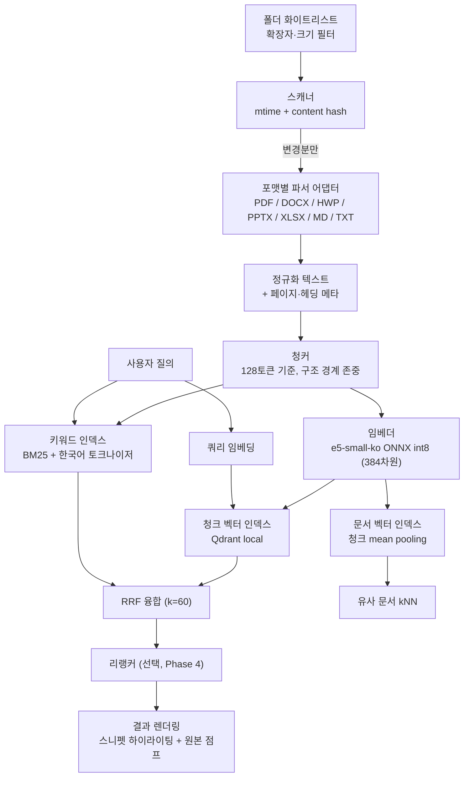

# 개인 문서 검색 시스템 — 개념 설계서

| 항목 | 내용 |
|---|---|
| 프로젝트 | SimpleRAG |
| 문서 | 01. 개념 설계서 |
| 작성일 | 2026-08-20 |
| 상태 | 초안 — Phase 1 착수 전 |
| 관련 문서 | `../results/REPORT.md` (속도 실측 리포트), `../bench/README.md` |

---

## 1. 한 줄 정의

**로컬 PC의 개인 문서를 임베딩으로 인덱싱하고, BM25 + 벡터 하이브리드 검색으로
관련 청크를 원문 그대로 찾아 보여주는 검색 도구.** 생성형 LLM은 쓰지 않는다.

두 가지를 제공한다.

1. **내용 검색** — "이 내용이 어느 문서 어디에 있지?" → 청크 단위 검색
2. **유사 문서 검색** — "이 문서와 비슷한 문서는?" → 문서 단위 검색

---

## 2. 배경 — 왜 sLLM을 뺐는가

이 결정은 취향이 아니라 **같은 노트북에서 측정한 데이터에 근거한다.**
(상세: `../results/REPORT.md`)

### 2.1 속도

| 구성 | 응답 시간 | 배율 |
|---|---:|---:|
| 검색만 (쿼리 임베딩 + 벡터 + BM25) | **약 136ms** | 1배 |
| 검색 + Qwen3-0.6B 생성 (top3 × 128) | 약 8,600ms | 63배 |
| 검색 + Qwen3-1.7B 생성 (top3 × 256) | 약 31,500ms | 232배 |

sLLM을 붙이는 순간 응답 시간이 **두 자릿수 배로 늘어난다.**
검색 도구의 기대 UX(즉시 반응)와 정면으로 충돌한다.

### 2.2 품질

| 모델 | 실측 판정 | 근거 |
|---|---|---|
| Qwen3-1.7B | 답변 양호 | 그러나 TTFT 14.7~21.3초 — **인터랙티브 불가** |
| Qwen3-0.6B | TTFT 2.71초로 유일하게 성립 | 그러나 **사실 혼동 빈발 — 단독 신뢰 불가** |

0.6B 실제 오답 예 (`../results/quality.json`):

> 질문: "연차휴가 미사용분에 대한 수당은 언제 지급되나요?"
> 답변: "매년 1월 1일부터 다음 달의 급여지급일에 지급되며…" → **산정 기준일과 지급일을 혼동**

즉 이 하드웨어에서 **쓸 만한 속도의 모델은 믿을 수 없고, 믿을 만한 모델은 너무 느리다.**
속도-품질 곡선에 실용 구간이 존재하지 않는다.

### 2.3 결론

REPORT.md 7절 5항이 이미 결론을 냈다.

> "0.6B 답변은 단독 신뢰 불가. **근거 청크를 항상 함께 노출하는 2단계 UX가 필수.**"

그렇다면 **생성 단계를 제거하고 근거 청크만 남기는 것**이 이 하드웨어에서
합리적인 귀결이다. 환각이 원천 차단되고, 응답은 63배 빨라지며,
사용자는 원문을 직접 보므로 신뢰 판단을 스스로 한다.

---

## 3. 목표 / 비목표

### 3.1 목표

| # | 목표 | 성공 기준 |
|---|---|---|
| G1 | 로컬 문서 의미 검색 | 자연어 질의로 원하는 청크가 top-5 안에 |
| G2 | 키워드 검색 병행 | 정확한 용어·고유명사 질의에서 놓치지 않음 |
| G3 | 유사 문서 탐색 | 임의 문서 기준 관련 문서 나열 |
| G4 | 즉시 응답 | 질의 응답 500ms 이내 (실측 기반 목표 200ms) |
| G5 | 원문 추적 | 결과에서 원본 파일·페이지로 바로 이동 |
| G6 | 최신 상태 유지 | 변경 파일만 증분 재색인 |

### 3.2 비목표 (명시적으로 하지 않는 것)

| # | 비목표 | 이유 |
|---|---|---|
| N1 | 답변 생성 / 요약 | 2절 참조 — 이 하드웨어에서 성립 안 함 |
| N2 | 멀티턴 대화 | 검색 도구이지 챗봇이 아님 |
| N3 | 다중 사용자 / 권한 관리 | 개인 단일 사용자 전제 |
| N4 | 클라우드 동기화 | 로컬 완결. 문서가 PC 밖으로 나가지 않음 |
| N5 | 디스크 전체 자동 인덱싱 | 폴더 화이트리스트 방식 (9절 D6) |

**N1은 영구 배제가 아니다.** 검색 레이어는 그대로 두고 나중에 얹을 수 있다 (10절 Phase 5).
하드웨어가 바뀌거나(GPU 탑재 PC) 더 작고 정확한 모델이 나오면 재검토한다.

---

## 4. 사용 시나리오

| # | 상황 | 입력 | 기대 결과 |
|---|---|---|---|
| U1 | 내용은 기억나는데 파일명이 기억 안 남 | "작년 계약 갱신 조건" | 해당 조항 청크 + 파일 링크 |
| U2 | 정확한 용어로 찾기 | "제26조" / 특정 인명 | 정확일치 우선 (BM25 담당) |
| U3 | 비슷한 문서 모으기 | 문서 A 선택 → "유사 문서" | 같은 주제 문서 목록 |
| U4 | 중복/유사본 정리 | 문서 A 선택 | 거의 동일한 사본 탐지 |
| U5 | 범위 좁혀 찾기 | 질의 + 폴더/기간/포맷 필터 | 필터 적용 결과 |

**U1이 핵심 시나리오다.** 기존 도구(Everything, Windows Search)가 못 하는 유일한 것이고,
이 프로젝트의 존재 이유다.

### 4.1 기존 도구 대비 위치

| 도구 | 파일명 | 본문 정확일치 | **본문 의미검색** | 유사문서 |
|---|:---:|:---:|:---:|:---:|
| Everything | ✅ 즉시 | ❌ | ❌ | ❌ |
| Windows Search | ✅ | △ 느림 | ❌ | ❌ |
| DocFetcher / Recoll | ✅ | ✅ | ❌ | ❌ |
| **SimpleRAG** | ✅ | ✅ | **✅** | **✅** |

경쟁 대상은 Open WebUI 같은 RAG 챗봇이 아니라 **데스크톱 검색 도구**다.
그 영역에서 의미 검색이 되는 제품은 사실상 비어 있다.

---

## 5. 시스템 아키텍처

### 5.1 파이프라인 요약

**인덱싱 (오프라인, 배치)**
스캔 → 파싱 → 청킹 → 임베딩 → 3개 인덱스 적재

**검색 (온라인, 실시간)**
질의 → (벡터검색 ∥ BM25) → RRF 융합 → [리랭킹] → 렌더링

벡터 검색과 BM25는 **서로 독립이므로 병렬 실행한다.**
직렬이면 136ms, 병렬이면 약 82ms (7.2절).

---

## 6. 구성요소별 기술 선택

### 6.1 확정 — 실측 근거 있음

| 요소 | 선택 | 실측 근거 |
|---|---|---|
| **임베딩 모델** | `dragonkue/multilingual-e5-small-ko` ONNX **int8**, 384차원 | 77.3 chunk/s. fp32(30.5) 대비 **2.5배 빠름**. CSOClassify 산출물 재사용 |
| **벡터 저장소** | **Qdrant local (임베디드)** | 5만 청크 검색 77.8ms, 디스크 221MB. 서버 프로세스 불필요 |
| **하이브리드** | BM25 + 벡터, **RRF (k=60)** | BM25 인덱스 구축 0.8초 — 사실상 공짜. 안 쓸 이유 없음 |
| **청크 크기** | **128토큰 기준** | 5만 청크 실측이 131토큰 기준. LLM이 없어 TTFT 제약은 사라지지만, 스니펫 표시에는 짧은 청크가 유리 |

> **BGE-M3를 기본으로 쓰지 않는 이유**
> 한국어 성능은 더 좋다고 알려져 있으나 파라미터 560M / 1024차원으로
> e5-small(118MB int8) 대비 이 CPU에서 훨씬 느리다.
> **이미 실측된 조합을 기준선으로 삼고**, 품질 비교는 Phase 4에서 정답셋으로 판정한다.

### 6.2 미확정 — 검증 필요

| 요소 | 후보 | 결정 시점 |
|---|---|---|
| **한국어 토크나이저** | Kiwi (순수 Python) / mecab-ko | **Phase 1 — 최우선** (6.4절) |
| **BM25 구현** | `rank_bm25` (현 벤치) / SQLite FTS5 / Tantivy | Phase 3 (증분 갱신 요건 확정 후) |
| **리랭커** | ONNX int8 소형 cross-encoder | Phase 4 — CPU 지연 실측 후 |
| **HWP 파서** | 사이냅 `snf_exe` (CSOClassify 자산) / pyhwp | 대상 문서에 HWP 포함 여부 확인 후 |
| **UI** | FastAPI + 정적 HTML | Phase 2 |

### 6.3 파서 어댑터

| 포맷 | 라이브러리 | 추출 메타 | 난이도 |
|---|---|---|:---:|
| PDF | PyMuPDF | 페이지 번호 | 하 |
| DOCX | python-docx | 헤딩 계층 | 하 |
| PPTX | python-pptx | 슬라이드 번호 | 하 |
| XLSX | openpyxl | 시트·셀 범위 | 중 |
| MD / TXT | 내장 | 헤딩 계층 | 하 |
| **HWP / HWPX** | 사이냅 `snf_exe` 재사용 권장 | 없음 | **상** |

포맷별 어댑터는 **공통 인터페이스**로 통일한다 — `parse(path) -> list[Block]`
(`Block` = 텍스트 + 위치 메타). 새 포맷 추가가 어댑터 한 개 추가로 끝나야 한다.

### 6.4 ⚠️ 최우선 이슈 — 한국어 BM25 토크나이저

**현재 벤치(`bench/bench_retrieval.py:275`)의 BM25는 `c.split()` — 공백 분리다.**

한국어에서 이건 사실상 동작하지 않는다.

| 질의 | 문서 내 표현 | 공백분리 매칭 | 형태소 분석 매칭 |
|---|---|:---:|:---:|
| `회의록` | `회의록을` | ❌ | ✅ |
| `계약` | `계약서에서` | ❌ | ✅ |
| `연차휴가` | `연차휴가는` | ❌ | ✅ |

조사가 붙는 순간 다른 토큰이 되어 **BM25가 통째로 무력화된다.**
한국어 하이브리드 검색이 안 먹는 사례의 대부분이 이것이다.

또한 현 벤치의 53.8ms는 **합성 코퍼스 + 공백 분리** 기준이므로
**지연 측정치일 뿐 품질 측정치가 아니다.** Kiwi 도입 시 지연은 늘어난다 (재측정 필요).

**→ Phase 1에서 Kiwi 명사 추출 색인으로 교체하고 지연을 재측정한다.**

---

## 7. 성능 예산

### 7.1 인덱싱 (실측 기반)

| 규모 | 청크 수 | 임베딩 | 적재 | **총계** | 디스크 |
|---|---:|---:|---:|---:|---:|
| 실측 기준 | 50,000 | 1,056s | 217s | **21분** | 221MB |
| 문서 2,500개 환산 | 50,000 | — | — | 약 21분 | 약 221MB |
| 문서 10,000개 환산 | 200,000 | — | — | **약 85분** | 약 890MB |

> ⚠️ **발열 스로틀링을 반영해야 한다.** 처리량이 69 → **47 chunk/s**로 지속 하락한다.
> 짧은 샘플로 추정한 11분이 실제로는 21분이었다.
> **장시간 작업은 하단값(47 chunk/s) 기준으로 계획한다.**

초기 전체 인덱싱은 **1회성 백그라운드 작업**으로 설계한다 (중단·재개 가능해야 함).
이후는 증분이므로 체감 비용이 없다.

### 7.2 질의 지연 (실측 기반)

| 단계 | 실측 | 비고 |
|---|---:|---|
| 쿼리 임베딩 | 3.9ms | |
| 벡터 검색 (top-3, 5만 청크) | 77.8ms | Qdrant local |
| BM25 검색 (top-3) | 53.8ms | ⚠️ 공백분리 기준 — 재측정 필요 |
| RRF 융합 | < 1ms | 순위 기반 산술 |
| **직렬 합계** | **약 136ms** | |
| **병렬 실행 시** | **약 82ms** | `max(77.8, 53.8) + 3.9` |

목표 G4(500ms) 대비 여유가 크다. **리랭커를 넣을 예산이 충분하다** — Phase 4에서 활용.

---

## 8. 데이터 모델

### 8.1 인덱스 3종

| 인덱스 | 단위 | 용도 | 저장소 |
|---|---|---|---|
| `chunks` | 청크 | 내용 검색 (U1, U2) | Qdrant local |
| `docs` | 문서 | 유사 문서 (U3, U4) | Qdrant local (별도 컬렉션) |
| `keywords` | 청크 | BM25 정확일치 (U2) | BM25 인덱스 파일 |

### 8.2 문서 벡터 생성

문서 벡터 = **해당 문서 청크 임베딩의 mean pooling** (정규화 후 평균, 재정규화).

- 인덱싱 시 한 번 계산해 별도 컬렉션에 저장
- 추가 임베딩 비용 없음 (청크 벡터 재사용)
- 문서 수는 청크 수의 수십 분의 1 → 저장·검색 비용 무시 가능

> **⚠️ 이건 Phase 1부터 넣어야 한다.**
> 나중에 추가하려면 문서-청크 관계를 다시 만들어야 하고, 최악의 경우 전체 재색인이다.
> **처음부터 청크/문서 두 레벨로 설계한다.**

### 8.3 청크 레코드 스키마 (초안)

| 필드 | 타입 | 설명 |
|---|---|---|
| `chunk_id` | str | 결정적 ID — `{doc_id}#{seq}` |
| `doc_id` | str | 파일 경로의 안정 해시 |
| `path` | str | 원본 절대 경로 |
| `seq` | int | 문서 내 청크 순번 |
| `text` | str | 청크 원문 (스니펫 표시용, 그대로 보존) |
| `n_tokens` | int | 토큰 수 |
| `page` / `heading` | int / str | 원본 위치 — **원본 점프(G5)에 필수** |
| `mtime` / `content_hash` | float / str | 증분 판정용 |
| `ext` / `size` | str / int | 필터용 |

### 8.4 증분 인덱싱 규칙

| 판정 | 조건 | 동작 |
|---|---|---|
| 신규 | `doc_id` 없음 | 파싱 → 색인 |
| 변경 | `mtime` 다름 **AND** `content_hash` 다름 | 기존 청크 전량 삭제 → 재색인 |
| 무변경 | `mtime` 같음 | 건너뜀 |
| 삭제 | 파일 없음 | 청크·문서 벡터 삭제 |

`mtime`만으로 판정하지 않는다 — 동기화 도구가 내용 변경 없이 mtime을 바꾸는 일이 흔하다.
mtime으로 1차로 거른 뒤 **해시로 확정**하면 불필요한 재색인을 막을 수 있다.

---

## 9. 핵심 설계 결정 요약

| # | 결정 | 근거 |
|---|---|---|
| D1 | **sLLM 미사용** | 63배 느려지고, 쓸 만한 속도의 모델은 사실 혼동 (2절) |
| D2 | **e5-small-ko int8 기준선** | 실측 2.5배 우위 + 기존 자산 재사용 (6.1절) |
| D3 | **Qdrant local 유지** | 78ms — 서버를 추가할 이유가 없음 (7.2절) |
| D4 | **청크/문서 2레벨 인덱스** | 유사문서를 나중에 얹으면 재색인 (8.2절) |
| D5 | **한국어 형태소 토크나이저 필수** | 공백분리는 조사 때문에 BM25 무력화 (6.4절) |
| D6 | **폴더 화이트리스트** | 전체 스캔은 노이즈 폭발 + 인덱싱 시간 폭증 |
| D7 | **Phase 1은 CLI로 종료** | UI부터 만들면 검색 품질 문제가 안 보임 |

---

## 10. 단계별 계획

| Phase | 범위 | 완료 판정 |
|---|---|---|
| **1** | 스캔 → 파싱 → 청킹 → 임베딩 → 3개 인덱스 → RRF → **CLI 검색** **+ Kiwi 토크나이저 도입 및 BM25 지연 재측정** | 실제 내 문서로 질의 10개, 원하는 결과가 top-5에 |
| **2** | 웹 UI (FastAPI + 정적 HTML), 스니펫 하이라이팅, 원본 파일/페이지 열기 | 실제로 계속 쓰게 되는가 |
| **3** | 증분 인덱싱(mtime + hash), 파일 변경 감시, 중단·재개 | 전체 재색인 없이 최신 상태 유지 |
| **4** | 리랭커, 유사 문서 검색 UI, 필터(기간/폴더/포맷) **정답셋 기반 Recall@10 / MRR 측정** | Phase 1 대비 개선폭이 수치로 확인됨 |
| **5** | *(선택)* 검색 결과 위에 sLLM 요약 얹기 | 하드웨어·모델 조건 재검토 후 판단 |

**Phase 1은 UI 없이 CLI로 끝낸다.** 검색 품질이 안 나오는 상태에서 UI를 만들면
문제가 파서인지, 청킹인지, 임베딩인지, 융합인지 분간할 수 없게 된다.

---

## 11. 평가 방법

### 11.1 정답셋

**질의 30~50개 + 정답 문서/청크**를 직접 작성한다. 제작에 약 2시간.
이후 **모든 튜닝 결정의 유일한 근거**가 된다.

### 11.2 지표

| 지표 | 의미 | 목표 |
|---|---|---|
| **Recall@10** | 정답이 상위 10개 안에 든 비율 | 1차 목표 ≥ 0.90 |
| **MRR** | 정답의 평균 역순위 — 얼마나 위에 있나 | ≥ 0.70 |
| **nDCG@10** | 순위 품질 종합 | 참고 |
| **p50 / p95 지연** | 질의 응답 시간 | p95 ≤ 500ms |

### 11.3 비교할 조합

| 축 | 후보 |
|---|---|
| 임베딩 모델 | e5-small-ko int8 **(기준선)** vs BGE-M3 vs 기타 |
| 청크 크기 | 128 vs 256 vs 512 토큰 |
| overlap | 0% vs 15% vs 25% |
| 융합 | RRF vs Weighted vs 벡터 단독 vs BM25 단독 |
| 토크나이저 | 공백분리 **(현재)** vs Kiwi 명사 |
| 리랭커 | off vs on |

> **RAGAS를 쓰지 않는다.** 생성이 없으므로 Faithfulness / Answer Relevancy는
> 정의되지 않는다. LLM 심판이 불필요해 **평가가 빠르고 완전히 재현된다** —
> 이것이 이 컨셉의 큰 장점이다.

---

## 12. 리스크

| # | 리스크 | 영향 | 대응 |
|---|---|---|---|
| R1 | **한국어 BM25가 공백분리** | 하이브리드의 절반이 무의미 | Phase 1 최우선 처리 (6.4절) |
| R2 | 발열 스로틀링으로 인덱싱 지연 | 예상의 2배 소요 | 47 chunk/s 하단 기준 계획, 중단·재개 지원 |
| R3 | HWP 파싱 실패 | 주요 문서 누락 | 사이냅 `snf_exe` 재사용 검토, 실패 파일 로그 |
| R4 | 짧은 키워드 질의에서 벡터 검색 열세 | 체감 품질 저하 | RRF가 완화. 정답셋으로 융합 방식 검증 |
| R5 | 스캔 범위 과다로 노이즈 폭발 | 결과 품질 저하 | 화이트리스트 + 확장자·크기 필터 (D6) |
| R6 | Qdrant local 공식 경고 (2만 초과) | 확장 시 성능 | 5만에서 78ms 실측 확인. 20만 초과 시 재측정 |
| R7 | e5-small(384차원) 품질 한계 | 검색 정확도 상한 | Phase 4에서 정답셋으로 BGE-M3 비교 판정 |

---

## 13. 남은 결정 사항

| # | 질문 | 영향 |
|---|---|---|
| Q1 | **대상 문서에 HWP가 포함되는가?** | 파서 난이도가 가장 크게 갈림 (6.3절) |
| Q2 | **대상 폴더 규모 — 문서 몇 개인가?** | 인덱싱 시간·디스크 예산 (7.1절) |
| Q3 | 인덱싱 대상 폴더 목록 | 화이트리스트 초기값 |
| Q4 | 스니펫 표시 방식 — 청크 전체 vs 매칭 주변 발췌 | UI 설계 (Phase 2) |

**Q1, Q2가 확정되면 Phase 1 스캐폴딩에 착수할 수 있다.**

---

## 부록 A. 실측 요약 (출처: `../results/`)

### A.1 하드웨어

| 항목 | 사양 |
|---|---|
| CPU | Intel Core i5-1340P — 12C/16T (P4 + E8), 부하 시 2.4~2.6GHz |
| SIMD | AVX / AVX2 / FMA / F16C — **AVX-512 없음** |
| RAM | 15.7GB LPDDR5-6000, 128bit → 약 96GB/s |
| GPU | Intel Iris Xe (내장) — **추론 미사용, CPU 온리** |
| 디스크 | Patriot M.2 P300 1TB NVMe |
| 런타임 | Python 3.12.10 |

### A.2 임베딩 처리량 (128토큰 청크)

| 모델 | 크기 | threads | batch | 처리량 |
|---|---:|---:|---:|---:|
| **model.onnx (int8)** | 118MB | **4** | **8** | **77.3 chunk/s** |
| model.onnx (int8) | 118MB | 8 | 8 | 75.2 chunk/s |
| model.fp32.onnx | 470MB | 4 | 8 | 30.5 chunk/s |
| model.fp32.onnx | 470MB | 8 | 8 | 30.5 chunk/s |

int8이 fp32보다 **2.5배 빠르다.** AVX-512(VNNI) 부재로 int8이 불리할 것이라는
사전 예측은 **틀렸다.** 배칭 효과는 미미하다 (batch 1→8: 65→77 chunk/s, 그 이상은 하락).

### A.3 5만 청크 인덱싱

| 단계 | 실측 |
|---|---:|
| 임베딩 (50,000 × 131토큰) | 1,056s (17.6분) |
| Qdrant local 적재 | 217s (3.6분) |
| **총계** | **1,273s ≈ 21분** |
| Qdrant 디스크 | 221MB |

### A.4 참고 — sLLM 실측 (미채택 근거)

| 모델 | 시나리오 | TTFT | decode | 정규화 총시간 |
|---|---|---:|---:|---:|
| Qwen3-0.6B-Q4 | top3 × 128 | **2.71s** | 33.9 t/s | 8.6s |
| Qwen3-0.6B-Q4 | top3 × 512 | 9.07s | 21.3 t/s | 18.5s |
| Qwen3-1.7B-Q4 | top3 × 256 | 14.69s | 11.9 t/s | 31.5s |

동일 조건(top3 × 256)에서 0.6B 대비 1.7B는 prefill·TTFT 모두 **3.8배 느리다.**

### A.5 측정 한계

- 1.7B decode 편차 11.9~15.2 t/s — 노트북 열·부스트 노이즈 약 ±15%
- 임베딩 처리량은 발열에 따라 69 → 47 chunk/s로 변동
- 검색 지연은 **합성 한국어 코퍼스** 기준. 실제 문서 분포에서 달라질 수 있음
- BM25 53.8ms는 **공백 분리** 기준 — 형태소 분석 도입 시 재측정 필요
